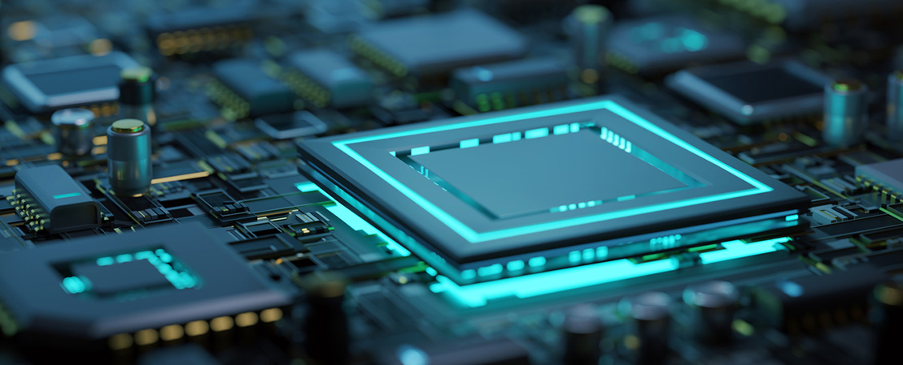

# Fundamentos de Hardware (Guía práctica) | Gabriel Ternero

---

# **MANUAL DE FUNDAMENTOS HARDWARE**

---

© Derechos reservados 2025 | Gabriel Ternero

Asignatura de **Fundamentos de Hardware**

by **Iker Iturbe**

**ASIR** | Curso 2025-2026 | **FP PROMETEO**

---

# Agradecimientos

Al **profesor Iker,** por su elevado grado de implicación con todo el grupo para que lográramos aprender sin mayores complicaciones los “fundamentos del hardware”; particularmente he desempolvado muchos recuerdos y además he aprendido nuevas herramientas fundamentales, pero, sobre todo, me he demostrado que a pesar de los años inactivo… ***¡sigo vigente!*  🫵😎✨**

---

# Contenido

[1. - Manual de configuración y reconocimiento de equipos](https://legendary-split-8cd.notion.site/1-Manual-de-configuraci-n-y-reconocimiento-de-equipos-2d2e1f2471ef814ab34cd270a72a3a60)

[2. - Manual de Montaje y mantenimiento de equipos](https://legendary-split-8cd.notion.site/2-Manual-de-Montaje-y-mantenimiento-de-equipos-2d2e1f2471ef8193a657f2f7c8f05129)

[3. - Manual de usuario y herramientas software](https://legendary-split-8cd.notion.site/3-Manual-de-usuario-y-herramientas-software-2d2e1f2471ef81c78043d8233827dab9)

---

### Nota final

Hasta aquí mi aporte en el Proyecto correspondiente a Fundamentos de Hardware, no obstante cabe señalar que iré aumentando progresivamente más temas de interés.

Es mi deseo que este proyecto (actividad entregable) sea de vuestro agrado y principalmente sirva de apoyo a quienes les apasione y tengan mucha curiosidad (como Yo) sobre la ***“anatomía de los ordenadores”***.

---